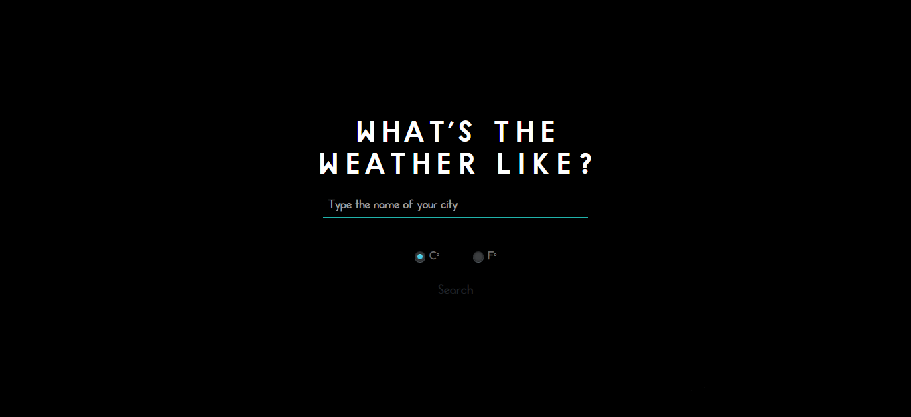
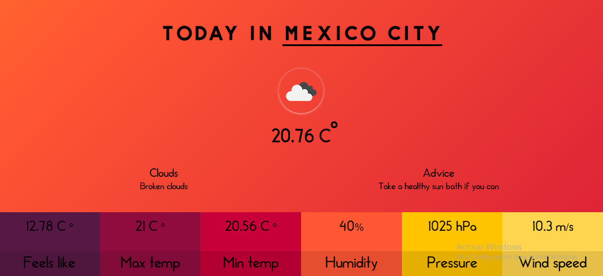

# ✨ weather-app

## 📝 Table of Contents

* [About the Project](#about-the-project)
  * [Built With](#built-with)
* [Contact](#contact)
* [Acknowledgements](#acknowledgements)

<!-- ABOUT THE PROJECT -->
## 👉 About The Project

Fun JavaScript weather application that uses data from an external API and display it on the screen.
This are the weather features that you can see:
*   Today's temperature
*   Today's min temp
*   Today's max temp
*   Feels like temp
*   Humidity percentage
*   Atmospheric Pressure
*   Wind speed
*   Min temp
*   Description of the weather
*   Cool weather advice for your day

The only thing that you need for starting is to write the name of your city and select between imperial and metric units.

### 🛠 Built With

*   SCSS - Style
*   Bootstrap4 - Positioning
*   JavaScript - Behaviour and Structure

<!-- CONTACT & SUPPORT -->
## Contact & Support

🙍 Guadalupe Rangel - kanemekanik@gmail.com - ☄

You liked it? ⭐️ Star the project!!!

<!-- ACKNOWLEDGEMENTS -->
## Acknowledgements

* [Microverse](https://www.microverse.org/)